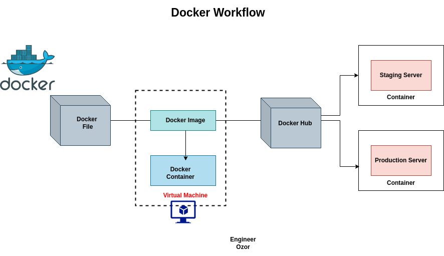
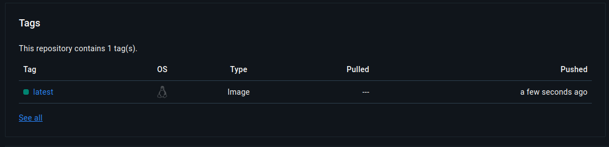

# K8s (Kubernetes)
Kubernetes is an open-source platform designed to automate the deployment, scaling & operations of containerized applications.
- **Container orchestration**
- **Scaling**
- **Load balancing**
- **Self-healing**
- **Rolling updates & Rollbacks**
  


## Minikube
Minikube is an open-source tool that enables to runn a single-node Kubernetes (both master & worker) on your local machine.

- **Single-Node Cluster**: Minikube runs a single-node Kubernetes cluster inside a virtual machine (VM) or container on your local machine. This node acts as both the master and worker node.
  
- **VM/Container Runtime**: Minikube supports various VM drivers (like VirtualBox, VMware, Hyper-V) and container runtimes (like Docker, containerd).
  
- `kubectl`: Minikube works with kubectl, the Kubernetes command-line tool, allowing you to manage your local cluster just like you would manage a full-scale cluster.

```sh
# Start
minikube start
minikube start --driver=<driver-name>

# Stop
minikube stop

# Delete minikube cluster
minikube delete

# Cluster status
minikube status
```
### Cluster management 

```sh
# View cluster info
kubectl cluster-info

# View nodes
kubectl get nodes

# Create pods
kubectl run <name> --image=<docker-image>
# View pods
kubectl get pods { app=<app-name> }
# M ore verbose with IP address
kubect get pods -o wide 

# View deployment
kubectl get deployment

# SSH into Minikube VM
minikube ssh (driver == docker) else : ssh docker@ip-minikube
```

### Networking
```sh
# View cluster services
kubectl get services

# Expose a service
kubectl expose deployment <deployment-name> --type=NodePort --port=8080
# If the port is different from the target port
kubectl expose deployment <deploymen-name> --port=8080 --target-port=<target-port>

# Access Minikube IP
minikube ip

# Access Service via NodePort
minikube service <service-name>

# Scale a deployment
kubectl scale deployment <my-deployment> --replicas=<n>
```
## Docker

### Containerize application
```sh 
# 1. Create DockerFile

# FROM : spécifie l'image de base à partir de laquelle l'image Docker sera construite

# COPY ou ADD : Copie des fichiers du système hôte vers le conteneur

# RUN : exécute des commandes dans le conteneur (i.e. installation de paquets)

# CMD : définit la commande par défaut à exécuter lorsque le conteneur démarre

# EXPOSE : indique quel port sera exposé pour accéder au conteneur

# ENTRYPOINT : définit le programme qui sera exécuté en premier lors du démarrage du conteneur
```


```sh 

# Create a customize image
docker build <path-to-dockerfile> -t <github-account>/<repo-name>:<tag>
# here  :  docker build . -t reynaldesgr/blazorapp
# (latest by default)

# See/Consult docker images
docker images 

# Push to Docker Hub
docker login
docker push reynaldesgr/blazorapp:<tagname>
# here: docker push reynaldesgr/blazorapp

```


### Create a Kubernetes deployment based on this image
Please check the status of minikube before performing this.
```sh 
minikube status

# if Minikube is stopped : 
minikube start 
```

*N.B. : Docker Hub repository need to be public.*

```sh 
kubectl create deployment blazorapp --image=reynaldesgr/blazorapp

kubectl get pods 

# NAME                         READY   STATUS    RESTARTS   AGE
# blazorapp-7bfc4c467d-cczfk   1/1     Running   0          37s

# Expose the deployment with a specified port
kubectl expose deployment blazorapp --port=8080

kubectl get svc
# NAME         TYPE        CLUSTER-IP    EXTERNAL-IP   PORT(S)    AGE
# blazorapp    ClusterIP   10.96.2.182   <none>        8080/TCP   21s
# kubernetes   ClusterIP   10.96.0.1     <none>        443/TCP    43h

# It is now available via Cluster IP into Minikube
minikube ssh
docker@minikube:~$ curl 10.96.2.182:8080
```
